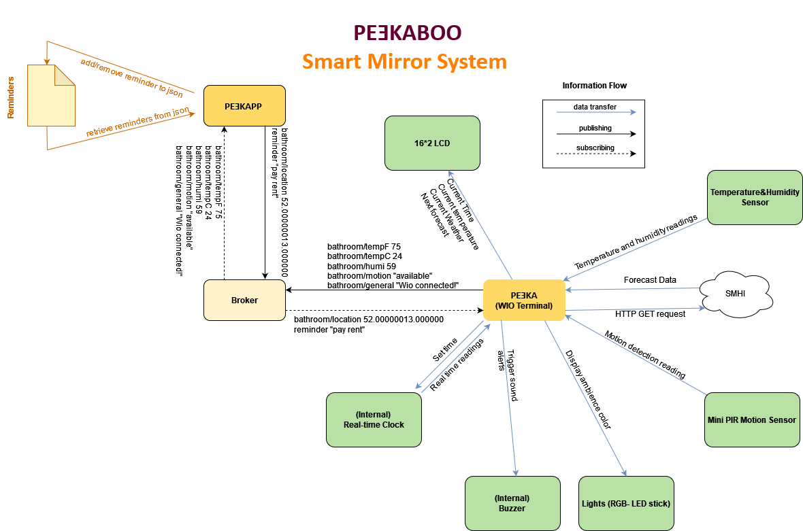

# PEƎKABOO

<!-- Readme guide: https://www.makeareadme.com/ -->
## Introduction:
PEƎKABOO is a product intended to aid the user in day-to-day life by gathering vital information to a place where we spend a lot of our time; The bathroom.
A lot of early mornings are spent in the bathrooms getting ready for the day, where we do our hair, shave, floss and brush our teeth. It's easy to lose track of time and fall behind on time in our daily routines. 

PEƎKABOO is a system with two components, namely a user application on a computer, and a "magic mirror" where time-sensitive information is displayed to the user. The mirror would display time, weather forecasts and to-do reminders. Information about bathroom temperature and humidity levels are also shown, and when these reach outside of desirable bounds the system can notify the user, for example so that build-up of mold can be prevented before it's too late. 

[Product demo](https://youtu.be/TFJkbOEFBHM?si=IdvPjOwM5rNXGEWZ) 

### Mirror Features:
- Displaying temperature and humidity of the bathroom.
- Shows the current time on a built-in 16x2 LCD display.
- Timer for brushing teeth and washing hands (2-minute countdown timer).
- Shows current weather and important forecast information.
- Shows user-created reminders.
- The mirror turns on when users enter the bathroom, and turns off when they leave.

### Application Features:
- Show the bathroom's current humidity levels and temperature in both fahrenheit and celsius.
- Show a notification and warn the user when the bathroom humidity is out of a specific range which could facilitate mold growth.
- Display the occupation status of the bathroom.
- Add or remove reminders that are shown on the mirror next time you enter the bathroom.
- Set the coordinates from the Settings screen so that the mirror could display relevant weather forecasts. 

## Architecture:
### Hardware Architecture:
Two parts: Wio and computer client. When connected to the internet, they communicate through an MQTT broker. Sensors send readings, and user sends input from PeekApp.

The following diagram illustrates the system components (the app, the broker and the WIO terminal) and the types of data these components are exchanging. 

### Software Architecture: 
##### WIO Terminal:
The software architecture on the Wio Terminal is for the most part built as a monolith, although we've attempted to divide different feature functionalities into their own subroutines. The classes we do have that aren't from external libraries all relate to the weather and forecasts feature.
- ForecastObserver's responsibility is to download forecast data, deserialize it, store it as WeatherData components, and to display the relevant weather information on the 16x2 LCD.
- WeatherData is responsible for storing forecast information for a given hour.
- WeatherCategory is responsible for simplifying and representing the [Wsymb2 value](https://opendata.smhi.se/apidocs/metfcst/parameters.html#parameter-wsymb) of SMHI's [Forecast Observations API](https://opendata-download-metfcst.smhi.se/pmp3gv2). It is a component of WeatherData.

##### PeekApp (JavaFX): 
The desptop application PeekApp currently has four java classes; Application.java, Controller.java, MqttConnection.java and WioNotification.java. 
- The Application.java is solely responsible for loading the main screen and launching the javaFx application.
- The Controller.java is responsible for specifying the behaviour for the different UI elements. For example, the app has buttons and each button must have a handler method that specifies what happens when this button is clicked, the Controller class is connected to the FXML (UI) elements and implements their behaviour. 
    - The Controller class also contains the initialize method which specifies some processes that should be started as soon as the app is launched. 
- The MqttConnection.java is responsible for creating MqttConnection objects which facilitates the connection between PeekApp and HiveMQ (the broker). It also implements the logic for getting the payload from the mqtt messages sent from the broker to the app. 
- The WioNotification.java creates reminder objects which are then sent to the WIO terminal through the broker. 

# Installation
## How to Contribute
First of all, you should clone the repository to your local machine. 

`git clone git@git.chalmers.se:courses/dit113/2024/group-10/pe-kaboo.git`

### Setting up Arduino IDE
Download the latest version of [Arduino IDE](https://www.arduino.cc/en/software).

Once installed, download and install Arduino AVR Boards from within the Boards Manager tab.

In order to verify, compile and upload code to the Wio Terminal, you must ensure that you have the right libraries on your local machine. Using Arduino IDE, download the following libraries via the Library Manager:
- [rpcWiFi](https://github.com/Seeed-Studio/Seeed_Arduino_rpcWiFi)*
- [PubSubClient](https://github.com/knolleary/pubsubclient)
- [Seeed_Arduino_LCD](https://github.com/Seeed-Studio/Seeed_Arduino_LCD)
- [DHT-sensor-library](https://github.com/adafruit/DHT-sensor-library)*
- [Adafruit Neopixel](https://github.com/adafruit/Adafruit_NeoPixel)
- [ArduinoJson](https://github.com/bblanchon/ArduinoJson)
- [Grove - LCD RGB Backlight](https://github.com/Seeed-Studio/Grove_LCD_RGB_Backlight)
- [DHT Sensor library](https://github.com/adafruit/DHT-sensor-library)*
- [Seeed Arduino RTC](https://github.com/Seeed-Studio/Seeed_Arduino_RTC)<!--Double check this is the correct one-->

_* has additional dependencies listed in the repository_

To test the device on your own Wifi network, replace the contents of WiFiName and password with your network SSID and password.

### Setting up IntelliJ IDEA (User Application)
For the user application side of the system, using IntelliJ:
- Download and install IntelliJ IDEA.
- Open up the pe-kaboo/app-code/peekApp directory as a project in IntelliJ IDEA.
- Let Maven build and update the indecies.
- Open up the Application.java class and run the application.
- If IntelliJ prompts you to setup SDK, click yes.

<!--wio-code/wio-main/wio-main.ino replace wifi username/password-->

## How to install
- As it stands now, no installation is needed for the **application**. The program is loaded to the memory of the mirror and the only part the user needs to set up is PeekApp (the desktop application) which does not need any special software to run; it can be launched from IntelliJ directly. 
- To get the **Wio** component running, clone the repository as instructed in [How To Contribute](https://git.chalmers.se/courses/dit113/2024/group-10/pe-kaboo/-/edit/main/README.md#how-to-contribute), and then follow the steps for [setting up Arduino IDE](https://git.chalmers.se/courses/dit113/2024/group-10/pe-kaboo/-/edit/main/README.md#setting-up-arduino-ide). When done, open up `wio-main.ino` in the `pe-kapp/wio-code/wio-main` folder, connect the Wio to your PC and upload the code.

## How does it work?
The mirror and application communicates through a broker using MQTT. The Wio publishes temperature and humidity data picked up from the [Sensors] and publishes it to the broker. Additionally, it also sends information on whether the bathroom is occupied or not. This is all received by the application running on the computer, where it is updated in real-time. From the application, reminders can be added and removed that are received on the Wio via the broker. These are then deserialized and stored in SRAM, and then showed on the main Wio display.

- When first starting the Wio, the system connects to the Wifi network and sends an HTTP get request to the SMHI Forecasts API, and receives weatherdata from a specified location (Default: Gothemburg). It then deserializes it and shows it on the 16x2 screen.
- Latitude and longitude are sent from the application to the Wio via the broker and gets the new forecast information for the given location.

<!--System Diagram--->

## Usage:
### Interacting with the Wio 
- Interation with 5 way switch:
The press button starts a timer of 120 seconds and all the other buttons force the timer to stop. If the press button is pressed again, it will start over the 120 seconds countdown.

### Interacting with PeekApp
- When PeekApp is launched, users will see the amin screen. From there, users can go to:  
    - Status which shows temperature, humididty and availability status of the bathroom.
    - Reminders where one can add/remove reminders which are then sent to the mirror to be displayed. 
    - Settings where one can update the coordinates that are then used to display weather status on the mirror. 

## Future Plans for PEƎKABOO:
The product has a potential for improvement in many areas, that is why there are some features planned for the future to make this product even more convenient. These improvements include: 
- Allowing the user to set the temperature/humidity limits from the settings screen. Right now the app displays warnings if the temperature and/or humididty are below or above a certain limit, but for convenience, the user should have control over that. 
- Allow the user to change the RGB lights on the mirror from the app. Again, this would be done from the settings screen.
- Allow the user to change wifi connection settings from the app. Right now these values are fixed and can only be changed by developers.  

## Limitations: 
- Sometimes after building the application, the application might not start. Restarting IntelliJ might help.
- The weather forecasts feature is only available for users in Sweden. 
- Battery life. The mirror has a limited battery life. 
- Internet connection. A slow connection may limit the system functions. 
- Limited number of reminders and a limited number or characters for each reminder. Due to the limited space in the WIO terminal, only 3 reminders can be displayed and each reminder cannot be more than 23 characters. 
- The system, as is, makes a lot of short-term connections to the broker. If using a free broker provided by HiveMQ for example, it only allows 100 connections in a certain time period. After a while the broker may be used up and need to be changed to another one. This can be remedied by upgrading to the starter plan which allows for unlimited connections.

# Contributors
Ibrahim Alzoubi
- Createthe first basic app UI. 
- Establishing the MQTT Connection (pub&sub) from the app side.
- Create and connecting the HiveMQ broker to the app. 
- Helped with the app notifications for both the logic and the user interface.
- Helped with the motion detection notification from the app side. 
- Create the reminders logic and user interface. 
- Helped with the weather settings (updating the coordinates) from the app side. 
- *Contributions to documentation:* helped creating the wiki, the requirements, the issues and the readme. 

Carl-Johan Erikson 
- Displaying weather status and forecasts
- TLS connection to the broker on the Wio
- Improving Wio responsiveness and performance
- Odd jobs here and there ☺

Rebecka Åkerblom
- Update Wio terminal and setup wifi
- Setup temperature and humidity sensor
- Setup Motion sensor
- Setup 10 strip LED
- Logic for motion sensor controlling led and backlight, and publish motion detection to app
- User interface and logic for occupation status in app
- Logic for reminders displaying in the Wio
- Basic user interface for app
- Establish MQTT Connection (sub) from the app side
- Notifications in app for temperature and humidity
- Assemble the prototype
- Create video
- Project Documentation

Jawad Ahmad
- Setup Wio Terminal display and setup connection to WiFi
- Setup temperature and humidity sensors, and logic required for their readings.
- Basic User Interface logic for App 
- Subscribe to MQTT broker from App, and display messages on UI
- Setup Motion Sensor, and logic required for its readings.
- Publish motion detection readings to app via MQTT broker
- Create logic for bathroom availability status in app
- Create basic UI design for Wio Display 
- Logic for reminders displaying in the Wio
- Add necessary configuration files for version control management
- Setup Build Pipeline for continuous integration for both app and wio codes
- Software testing on hardware components 
- Project Documentation 

Setareh Goldchin Jouposhti
- Create requirements
- Setup HIVEMQ broker 
- Enable publish from wio terminal to broker
- Setup Real Time Clock (RTC) 
- Setup and implement logic for timer for brushing teeth
- Setup notification for humidity and temperature to the app
- Assemble the prototype
- Create video for presentation
- Edit video for presentation

